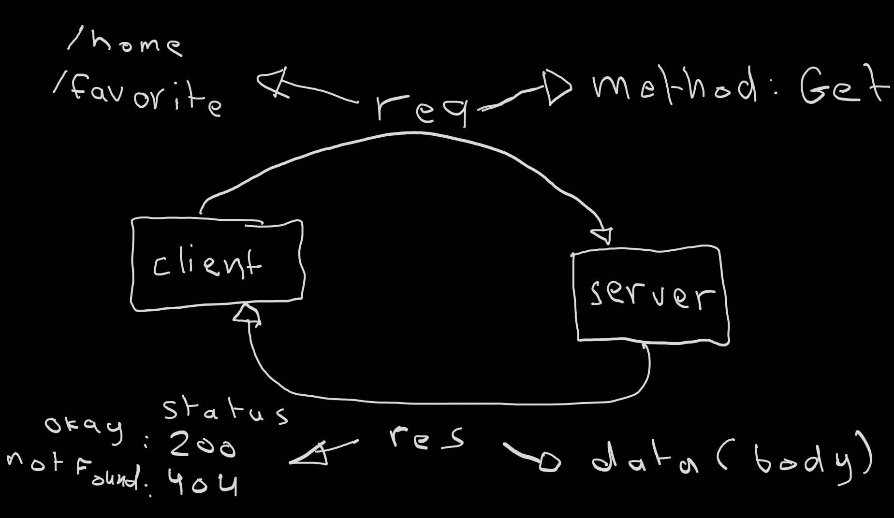

# Movies-Library - Project Version

**Author Name**: Abdallah Toughoj

## WRRC

## Overview
For lab 11, I will set up the server for the movie app and create the basic structures.
For lab 12, I will be sending get requests to a 3rd party API and display data.
For lab 13, I will set up my database and read and save data to it.
For lab 14, I will be able to update and delete an entry in my database.
## Getting Started
1. npm init -y
2. create (index.js) file
3. npm i express dotenv pg cors body-parser
## Project Features
The server has three routes with their handler :
1. home page : when the client request "/" the callback will return the provided JSON data in the file"data.json" with a new structure that the constructor provide.
2. favorite page : when the client request "/favorite" the callback will return "Welcome to Favorite Page".
3. status 404 : when the client request any route except "/" and "/favorite" the callback will return "page not found error" and the status will be 404.
4. addMovie : this route add a new movie to the database
5. getMovies : this route get all movies from the database
6. updateMovies : this route update a personal comment for a specific movie in the database
7. deleteMovies : this route delete a specific movie from the database
8. getSpecificMovie : this route get a specific movies from the database
9. trending : this route get trending movies from an api
10. search: this route get specific movies from an api based on movie title
11. certification: this route get the certifications from an api
12. popular: this route get the movies popularity from an api